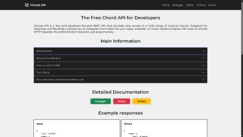

  

Me llamo Rafa Alday y soy desarrollador web, especializado en React, Express, Node, MongoDB y MySQL. Te invito a seguir leyendo para saber un poco más acerca de mis habilidades y proyectos destacados.

Antes de nada, te invito a ver mi portfolio, donde puedes ver todos mis proyectos y filtrarlos por tecnologías => [ALDAYDEV PORTFOLIO](https://alday.dev)

 
<h2 align="center">TECNOLOGÍAS</h2>

### 🧑‍💻 LENGUAJES  
 
  

### 🖥️ FRONT-END  
       

### ⚙️ BACKEND
              

### 🧪 TESTING
   

### 📝 DOCUMENTACIÓN
 

### 📦 BASES DE DATOS
  

### 🚀 DESPLIEGUES
   

### 🧰 HERRAMIENTAS DE GESTIÓN
    

 
<h2 align="center"> PROYECTOS </h2>

  

  
  

---

### Portal de músicos (Versión Beta)  
  

-   
-   

---

### Pokemon Game  

  
  
  

---

### CV Audiovisual  

  
  

---

### Dev Agency CSS Layout  

  
  

---

### Gamer News Portal CSS Layout  

  
  

---

### Web Musical  

  
  

### The Chords API
   * Desplegado: (https://chords.alday.dev)
   * Vídeo Presentación: (https://youtu.be/AeSVz7Ewje8)
   * Repositorio: (https://github.com/aldaydev/chords_api)

### Portal de músicos (Versión Beta)
   * Repositorio back (https://github.com/aldaydev/musikos_server)
   * Repositorio front (https://github.com/aldaydev/musikos_client)
  
### Pokemon Game
   * Desplegado: (https://pokegame.alday.dev)
   * Video Presentación: (https://youtu.be/MxDscYjcJKU)
   * Repositorio: (https://github.com/aldaydev/pokegame)

### CV Audiovisual 
   * Desplegado: (https://cvaudiovisual.alday.dev)
   * Repositorio: (https://github.com/aldaydev/CV_AUDIOVISUAL)

### Dev Agency CSS Layout 
   * Desplegado: (https://devagency.alday.dev)
   * Repositorio: (https://github.com/aldaydev/dev-agency)

### Gamer News Portal CSS Layout 
   * Desplegado: (https://gamer.alday.dev)
   * Repositorio: (https://github.com/aldaydev/gamer)

### Web Musical
   * Desplegado: (https://alday.es)
   * Repositorio: (https://github.com/aldaydev/alday_es.git)

<!--
**aldaydev/aldaydev** is a ✨ _special_ ✨ repository because its `README.md` (this file) appears on your GitHub profile.

Here are some ideas to get you started:

- 🔭 I’m currently working on ...
- 🌱 I’m currently learning ...
- 👯 I’m looking to collaborate on ...
- 🤔 I’m looking for help with ...
- 💬 Ask me about ...
- 📫 How to reach me: ...
- 😄 Pronouns: ...
- ⚡ Fun fact: ...
-->
